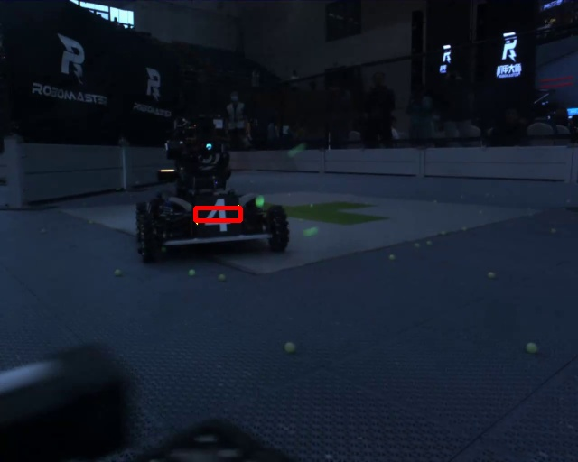
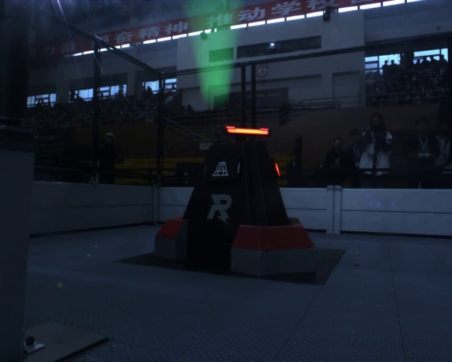
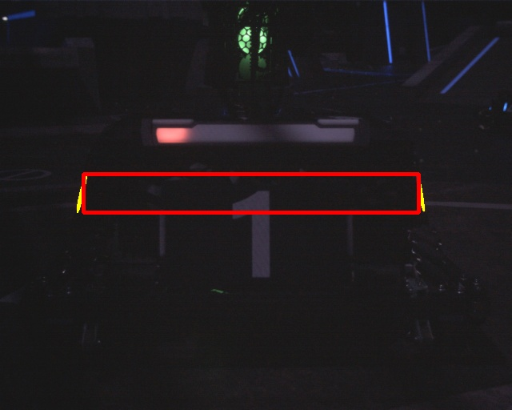
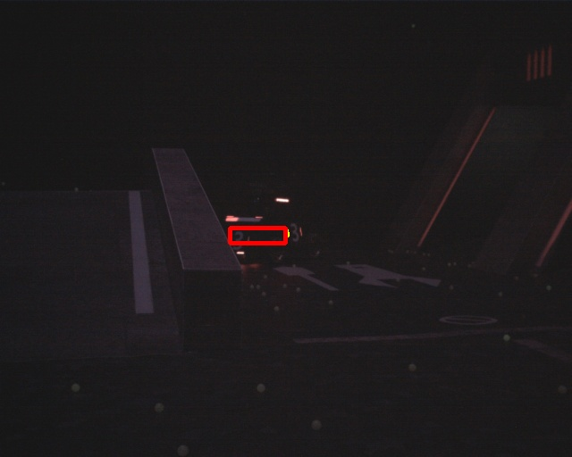

# 灰暗装甲板检测

author : 刷子

**步骤** 

1. 先尽可能找出亮着的装甲板，如果存在可以匹配的灯条对，则顺利完成检测

2. 如果亮的装甲板（例21600、1671）不足以完成匹配，则将原图灰化，检测canny边缘框出一定阈值的范围，但这样范围会偏大，需要剔除一些区域

3. 得到范围与亮灯条做bit_or，再做一遍筛选，附近有亮灯条的区域取得高权重，剔除低权重区

4. 取形状，把所有形状等同亮灯条处理，用培训时写过的lightboard类直接匹配（权重法），圈出装甲板

**解释**

1. 上述步骤3依赖了亮灯条来做筛选，如果没有亮灯条的话匹配会有点棘手，好在lightboard还抗的住（例1671），所以纯灰灭灯条还是比较有挑战性的

2. 前哨站的识别我还没写，lightboard现在还是匹配车子的，所以导致2203没有东西识别出来

1671

2203

6400

6480

21600
